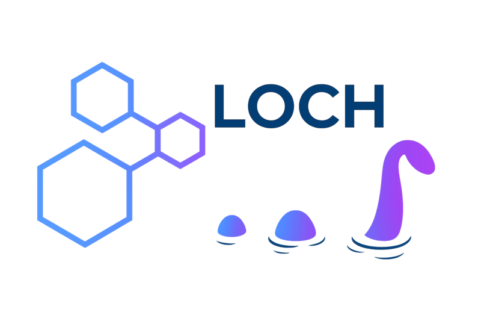

<p align="center">
    <picture align="center">
        
    </picture>
</p>

# Loch

[](https://github.com/openbiosim/loch/actions/workflows/devel.yaml)
[](https://anaconda.org/openbiosim/loch)
[](https://www.gnu.org/licenses/gpl-3.0.en.html)

CUDA/OpenCL accelerated Grand Canonical Monte Carlo (GCMC) water sampling code. Built
on top of [Sire](https://github.com/OpenBioSim/sire),
[BioSimSpace](https://github.com/OpenBioSim/biosimspace),
[OpenMM](https://github.com/openmm/openmm),
[PyCUDA](https://documen.tician.de/pycuda/index.html#),
and [PyOpenCL](https://documen.tician.de/pyopencl/).

## Installation

### Conda package

Install `loch` directly from the `openbiosim` channel:

```
conda install -c conda-forge -c openbiosim loch
```

Or, for the development version:

```
conda install -c conda-forge -c openbiosim/label/dev loch
```

### Installing from source (standalone)

To install from source using [pixi](https://pixi.sh), which will
automatically create an environment with all required dependencies
(including pre-built [Sire](https://github.com/OpenBioSim/sire) and
[BioSimSpace](https://github.com/OpenBioSim/biosimspace)):

```
git clone https://github.com/openbiosim/loch
cd loch
pixi install
pixi shell
pip install -e .
```

> [!Note]
> Pixi does not run conda post-link scripts, so the `ocl-icd-system`
> symlink needed for OpenCL won't be created automatically. After
> creating the environment (or after a pixi update), run the following
> to fix this:
>
> ```bash
> pixi shell
> ln -sfn /etc/OpenCL/vendors "${CONDA_PREFIX}/etc/OpenCL/vendors/ocl-icd-system"
> ```

### Installing from source (full OpenBioSim development)

If you are developing across the full OpenBioSim stack, first install
[Sire](https://github.com/OpenBioSim/sire) from source by following the
instructions [here](https://github.com/OpenBioSim/sire#installation), then
activate its pixi environment:

```
pixi shell --manifest-path /path/to/sire/pixi.toml -e dev
```

You may also need to install other packages from source, e.g.
[BioSimSpace](https://github.com/OpenBioSim/biosimspace):

```
pip install -e /path/to/biosimspace
```

Then install `loch` into the environment:

```
pip install -e .
```

## Development

Pre-commit hooks are used to ensure consistent code formatting and linting.
To set up pre-commit in your development environment:

```
pixi shell -e dev
pre-commit install
```

This will run [ruff](https://docs.astral.sh/ruff/) formatting and linting
checks automatically on each commit. To run the checks manually against all
files:

```
pre-commit run --all-files
```

## How does it work?

Instead of computing the energy change for each trial insertion/deletion with
OpenMM, the calculation is performed at the reaction field (RF) level using
a custom CUDA/OpenCL kernel, allowing multiple candidates to be evaluated
simultaneously. Particle mesh Ewald (PME) is handled via the method for
sampling from an approximate potential (in this case the RF potential)
introduced [here](https://doi.org/10.1063/1.1563597). Parallelisation of the
insertion and deletion trials is achieved using the strategy described in
[this](https://doi.org/10.1021/acs.jctc.0c00660) paper. `loch` has been
designed to be modular, allowing standalone GCMC sampling, or integration with
OpenMM-based molecular dynamics simulation code, e.g. as has been done in the
[SOMD2](https://github.com/openbiosim/somd2) free-energy perturbation engine.
See our [whitepaper](WHITEPAPER.md) for further technical details.

## Usage

1) Load the molecular system of interest, e.g.:

```python
import sire as sr

mols = sr.load_test_files("bpti.prm7", "bpti.rst7")
```

1) Create a `GCMCSampler`:

```python
from loch import GCMCSampler

sampler = GCMCSampler(
    mols,
    reference = "(resnum 10 and atomname CA) or (resnum 43 and atomname CA)",
    num_attempts=10000,
    batch_size=1000,
    cutoff_type="pme",
    cutoff="10 A",
    radius="4 A",
    temperature="298 K",
    num_ghost_waters=50,
    bulk_sampling_probability=0.1,
    platform="auto",
    log_level="info",
)
```

Here the `reference` is a Sire selection string for the atoms that define
the centre of geometry of the GCMC sphere. Each GCMC move consists of
a total of `num_attempts` random insertion and deletion attempts, with
`batch_size` number of attempts being performed in parallel. The
`bulk_sampling_probability` controls the probability performing a bulk
sampling move, i.e. performing attempts within the entire simulation box,
rather than just within the GCMC sphere.

The GPU platform is controlled via the `platform` argument, which can be set to
`"cuda"`, `"opencl"` or `"auto"` (default). When set to `"auto"`, `loch` will
attempt to use the CUDA platform first, falling back to OpenCL if CUDA is not
available.

1) Get the GCMC system:

In order to perform a simulation we need to get back the GCMC system, which
contains an additional `num_ghost_waters` number of ghost water molecules
that are used for insertion moves.

```python
gcmc_system = sampler.system()
```

1) Create an OpenMM context:

We can directly use the Sire dynamics interface to create an OpenMM context
for us, e.g.:

```python
d = gcmc_system.dynamics(
    integrator="langevin_middle",
    temperature="298 K",
    pressure=None,
    cutoff_type="pme",
    cutoff="10 A",
    constraint="h_bonds"
    timestep="2 fs",
)
```

> [!Note]
> While we have used Sire to create the OpenMM context, you can also write
> the GCMC system to file and create the OpenMM context manually. See [here](#notes)
> for an example of how to perform an OpenMM-to-Sire roundtrip.

> [!Note]
> GCMC sampling must be performed in the NVT ensemble, hence the pressure
> is set to `None` in the above example. However, bulk sampling moves can
> be used as an effective barostat.

In order to enable crash recovery during dynamics, we next need to bind
the `GCMCSampler` to the Sire dynamics object. This makes sure that the
water state is correctly reset in the OpenMM context when restarting from
a crash:

```python
sampler.bind_dynamics(d)
```

1) Run dynamics with GCMC sampling:

```python
# Set the cycle frequency for saving ghost residue indices.
frame_frequency = 50

# Run 1ns of dynamics and perform GCMC moves every 1ps.
for i in range(1000):
    # Run 1ps of dynamics.
    d.run("1ps", energy_frequency="50ps", frame_frequency="50ps")

    # Perform a GCMC move.
    moves = sampler.move(d.context())

    # If we hit the frame frequency, then save the current ghost residue indices.
    if i > 0 and (i + 1) % frame_frequency == 0:
        sampler.write_ghost_residues()

    # Print the current status.
    print(
        f"Cycle {i}, N = {sampler.num_waters()}, "
        f"insertions = {sampler.num_insertions()}, "
        f"deletions = {sampler.num_deletions()}"
    )
    print(
        f"Current potential energy: {d.current_potential_energy().value():.3f} kcal/mol"
    )

# Save the trajectory.
mols = d.commit()
sr.save(mols.trajectory(), "gcmc_traj.dcd")
```

> [!Note]
> `loch` is designed to be compatible with [grand](https://github.com/essex-lab/grand),
> so you can make use of the `grand.utils` module to perform post-simulation analysis,
> such as trajectory processing and water cluster analysis.

## Calibrating the GCMC potential

The default GCMC potential parameters are calibrated for the TIP3P water model
at 298 K and 1 bar. To use `loch` with other water models we provide a
[utility module](src/loch/_utils.py) for calibrating the excess chemical
potential and standard volume for a given water model at a specified
temperature and pressure. The excess chemical potential is computed via
an alchemical decoupling simulation of a water molecule in bulk solvent, while
the standard volume is computed from constant pressure simulations of bulk water.

To compute the excess chemical potential, you will first need to install the
[SOMD2](https://github.com/openbiosim/somd2) package into your conda environment:

```
conda install -c openbiosim somd2
```

The excess chemical potential can be computed as follows:

```python
import sire as sr
from loch import excess_chemical_potential

mols = sr.load("water.prm7", "water.rst7")

mu_ex = excess_chemical_potential(
    mols,
    temperature="298 K",
    pressure="1 bar",
    cutoff="10 A",
    runtime="5 ns",
    num_lambda=24,
    replica_exchange=True,
)
```

Here `water.prm7` and `water.rst7` are the topology and co-ordinates files
for an equilibrated bulk water system. Any file format supported by Sire
can be used. The `num_lambda` parameter controls the number of alchemical
intermediate states used in the decoupling simulation, while the
`replica_exchange` flag enables replica exchange between the alchemical states
to enhance sampling.

Once finished, `mu_ex` will contain the computed excess chemical potential in units
kcal/mol.

Note that the simulation requires a system with CUDA or OpenCL support. Please
set the `CUDA_VISIBLE_DEVICES` or `OPENCL_VISIBLE_DEVICES` environment variable
accordingly.

The standard volume can be computed as follows:

```python
import sire as sr
from loch import standard_volume

mols = sr.load("water.prm7", "water.rst7")

v_std = standard_volume(
    mols,
    temperature="298 K",
    pressure="1 bar",
    cutoff="10 A",
    num_samples=1000,
    sample_interval="1 ps",
)
```

Once finished, `v_std` will contain the computed standard volume in units
of ų.

## Examples

A full set of examples can be found in the [examples](examples) directory.

## GCMC Free Energy Perturbation

Free Energy Perturbation (FEP) with GCMC using `loch` is supported via the
[SOMD2](https://github.com/OpenBioSim/somd2) package.

## Notes

* When using the CUDA platform, make sure that `nvcc` is in your `PATH`. If you require
  a different `nvcc` to that provided by conda, you can set the `PYCUDA_NVCC` environment
  variable to point to the desired `nvcc` binary, or use the `nvcc` kwarg in the
  `GCMCSampler` constructor. Depending on your setup, you may also need to install the
  `cuda-nvvm` package from `conda-forge`.

* OpenMM-to-Sire roundtrip example:

```python
from openmm.app import AmberPrmtopFile, AmberInpcrdFile, PDBFile
from loch import GCMCSampler

import parmed as pmd
import sire as sr

# Here we have an existing OpenMM system in omm_system.

# Load a PDB representation of the topology.
pdb = PDBFile("system.pdb")

# Create a ParmEd structure.
struct = pmd.openmm.load(
    pdb.topology,
    omm_system,
    xyz=pdb.positions,
)

# Save the structure to AMBER format files.
struct.save("system.prmtop")
struct.save("system.inpcrd")

# Load the system into Sire.
mols = sr.load("system.prmtop", "system.inpcrd")

# Define the GCMC reference selection. (This should be adjusted as needed.)
gcmc_reference = "(resnum 10 and atomname CA) or (resnum 43 and atomname CA)"

# Create the GCMCSampler.
sampler = GCMCSampler(
    mols,
    reference = gcmc_reference,
)

# Get the GCMC system.
gcmc_system = sampler.system()

# Save the GCMC system to AMBER format files.
sr.save(gcmc_system, ["gcmc_system.prmtop", "gcmc_system.inpcrd"])

# Load the GCMC system back into OpenMM.
prmtop = AmberPrmtopFile("gcmc_system.prmtop")
inpcrd = AmberInpcrdFile("gcmc_system.inpcrd")
```

## Acknowledgements

* We thank the [Essex Lab](https://essexgroup.soton.ac.uk/) and
  [grand](https://github.com/essex-lab/grand) for the inspiration.
* Many thanks to [Gregory Ross](https://github.com/gregoryross) for clarifying
  the parallelisation scheme described [here](https://doi.org/10.1021/acs.jctc.0c00660).
