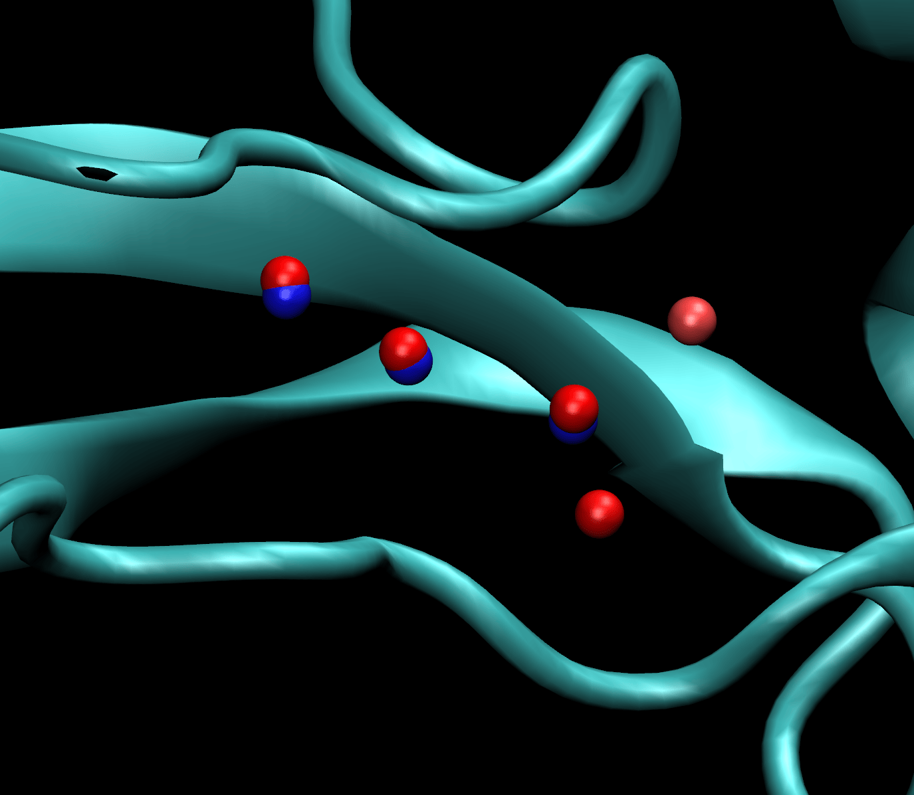

# Loch: CUDA accelerated Grand Canonical Monte Carlo (GCMC) water sampling

## Introduction

We present `loch`, a high-performance CUDA-accelerated Python package designed
for Grand Canonical Monte Carlo (GCMC) water sampling in molecular simulations
via [OpenMM](https://openmm.org/). To enable parallelisation of insertion and
deletion attempts, `loch` leverages GPU capabilities using a custom CUDA kernel
for nonbonded interactions. This allows thousands of GCMC trials to be attempted
in parallel, significantly enhancing sampling efficiency compared to traditional
CPU-based implementations that perform sequential attempts via the OpenMM Python
API. Additionally, electrostatics for GCMC attempts are computed using the
reaction field (RF) method, with accepted candidates being re-evaluated with a
correction step based on the difference between reaction field and Particle Mesh
Ewald (PME) potential energies. The use of an approximate potential for trial
moves leads to a substantial speed-up in GCMC move evaluation. `loch` has been
designed to be modular, allowing standalone GCMC sampling, or integration with
OpenMM-based molecular dynamics simulation code, e.g. as has been done in the
[SOMD2](https://github.com/openbiosim/somd2) free-energy perturbation engine.

## Parallelisation strategy

The parallelisation strategy employed in `loch` is based on the implementation
described by [Ross et al. (JCTC, 2020)](https://doi.org/10.1021/acs.jctc.0c00660).
In this approach, a serial Monte Carlo processed is mapped onto a parallel GPU
architecture as follows:

1. A batch of $N_\mathrm{batch}$ random insertion and deletion trials are
proposed and evaluated in parallel on the GPU, indexed by the GPU thread ID.
2. In parallel, each trial is accepted or rejected based on the Metropolis
criterion.
3. If any trial is accepted, the one with the lowest thread ID is selected and
applied to the system. The rest of the trials in the batch are discarded.
4. The number of attempts is then incremented by the thread ID of the accepted
trial, or the batch size if no trials were accepted.
5. Steps 1-4 are then repeated until the desired number of total attempted
trials, $N_\mathrm{attempts}$, have been performed.

This strategy ensures that the results are statistically equivalent to those
that would be obtained from a serial GCMC implementation, while taking full
advantage of GPU parallelism to evaluate multiple trials simultaneously. In
the scheme above a _trial_ refers to a single insertion or deletion attempt,
and a _move_ refers to the entire sequence, i.e. $N_\mathrm{attempts}$ trials.

In order to avoid wasted computation, the batch size, $N_\mathrm{batch}$, is
typically chosen based on the equilibrium acceptance probability of GCMC trials
for the system of interest, i.e. on average, you want one trial to be accepted
per batch. Larger batch sizes increase the likelihood of multiple accepted
attempts, meaning that some accepted trials will be discarded, leading to wasted
computation. A larger batch size also increases the computational cost of
each iteration, as more trials need to be evaluated in parallel, and more data
needs to be transferred to and from the GPU, in which case it might be more
efficient to simply perform more iterations with a smaller batch size.

## Sampling from an approximate potential

In order to further accelerate the evaluation of GCMC insertion and deletion
trials, `loch` employs the method for sampling from an approximate potential
introduced by [Gelb (J.Chem.Phys., 2003)](https://doi.org/10.1063/1.1563597).
In this approach, an approximate potential energy function, $U'$, is used to
evaluate attempts, rather than the full potential energy function, $U$. This
generates a set of accepted _candidate_ insertions and deletions. To correct for
sampling from the approximate potential, each candidate is then re-evaluated
using the full potential, and accepted or rejected using a Metropolis criterion
that accounts for the difference between the two potentials, i.e.
$\min \left( 1, \exp[-\beta ((U(j) - U(i)) - (U'(j) - U'(i))] \right)$,
where $\beta = 1/(k_{\mathrm{B}} T)$.

In `loch`, the reaction field (RF) method is used as the approximate
electrostatic potential, while the full potential is computed using
Particle Mesh Ewald (PME). This approach provides a significant speed-up in
the evaluation of GCMC trials, while still ensuring that the correct Boltzmann
distribution is sampled. In addition, it also allows for a modification to the
parallelisation strategy described above. If a candidate is found to fail the
full potential correction criterion, the process continues to the next
candidate from the batch until one is found that passes both criteria, or all
candidates in the batch have been evaluated. This ensures that the results
remain statistically equivalent to those obtained from a serial implementation
using the full potential for all trial evaluations, while only requiring the
minimum number of full PME evaluations. This further enhances the efficiency of
the GCMC sampling process.

Given the significant performance enhancements provided by the simple strategies
described above, we choose to avoid use of additional techniques, such as
cavity-biasing, which can introduce additional complexity and bookkeeping
overheads that could negate the performance benefits.

## Performance limitations

Other than the cost of evaluating GCMC trials using PME, performance is aslo
impacted by the cost of updating nonbonded parameters and atomic positions
in the OpenMM context after each accepted insertion or deletion. (No updates
are required for trial moves, since these are all evaluated via the custom
CUDA kernel.) [Recent updates](https://github.com/openmm/openmm/pull/4610)
to OpenMM have helped mitigate the cost of modifying force field parameters,
allowing updates for only the subset of parameters that have changed within
a particular force. However, updating atomic positions still requires
re-uploading all atomic coordinates to the GPU after each accepted move,
rather than only the coordinates of the inserted water molecule. This could
provide a further avenue for performance improvement in future versions of
OpenMM.

## Examples

To test the performance and accuracy of `loch`, we have applied it to several
test systems that have been studied previously in the literature.

### Bulk water sampling

We first validate the implementation by simulating bulk water, as previously
done by [Samways et al. (JCIM, 2020)](https://doi.org/10.1021/acs.jcim.0c00648)
using the [grand](https://github.com/essex-grand/grand) GCMC package.
To calibrate our GCMC potential, we first peformed an alchemical decoupling
simulation for a single TIP3P water molecule from bulk at a temperature of
298 K and a pressure of 1 bar, using the
[SOMD2](https://github.com/openbiosim/somd2) package. From this, we obtained
a value for the excess chemical potential of
$\mu'_\mathrm{sol} = -6.09$ kcal/mol, in exact agreement with the value
reported by Samways et al. The standard volume was calibrated using the
density of TIP3P water at these conditions, as obtained from 100 ns of constant
pressure simulation with OpenMM, yielding a value of $V^\circ = 30.543 A^3$.

Using these parameters, we then performed a 100ns GCMC simulation of bulk water
in a 40 Å cubic box, using the script provided in the
[examples/water](examples/water) directory. The following plot shows the density
of water over the course of the simulation using both RF and PME electrostatics,
compared to the expected density of TIP3P water at these conditions, as obtained
from constant pressure simulations. The results show excellent agreement with the
expected density, validating the implementation of GCMC in `loch`, as well as the
correct calibration of the GCMC potential.

Running on an NVIDIA RTX 5070Ti GPU, the simulation achieved a performance of
approximately 68 ms per GCMC move, where a move consisted of 10000 attempted
random insertions and deletions, with a batch size of 1000 trials.

### Bovine pancreatic trypsin inhibitor (BPTI)

Next, we applied `loch` to the simulation of water in and around bovine
pancreatic trypsin inhibitor (BPTI), as also studied by
[Samways et al. (JCIM, 2020)](https://doi.org/10.1021/acs.jcim.0c00648).
Following their approach, we defined a GCMC sphere of 4.2 Angstrom radius
positioned using the centre of geometry of the alpha carbons of residues
10 and 43. Prior to GCMC sampling we deleted any crystallographic waters
within this sphere and performed 100 GCMC moves (each of 10000 total attempts)
on the static structure to equilibrate the number of waters in the sphere.
Following this, we ran 10ns of dynamics, with GCMC moves performed every
picosecond. A full script can be found in the [examples/bpti](examples/bpti)
directory. Afterwards, we then clustered the water positions using a 2.4 Å
cutoff, as done by Samways et al., to identify the major water sites sampled
during the simulation. This was performed using the tools from the
[grand.utils](https://github.com/essex-lab/grand/blob/master/grand/utils.py)
module.

The following figure shows the resulting water clusters (overlaid on the crystal
structure waters) obtained from simulation. Blue spheres indicate the positions
of the crystallographic waters, while red spheres indicate the position of the
water oxygen atom from simulation that were closest to the centre of each
cluster. Darker red spheres indicate clusters with higher occupancy. The
results show good agreement with the crystallographic waters, as well as
identifying several additional lower occupancy water sites not present in the
crystal structure, in line with the results obtained by Samways et al.

