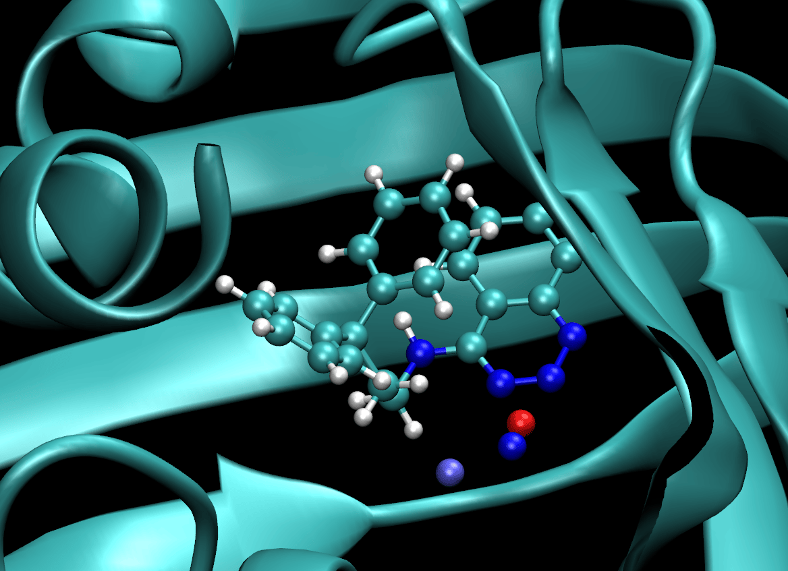

# Scytalone dehydratase (SD)

Perform 100 ps of GCMC sampling of water in the binding site of scytalone dehydratase (SD):

```
cd examples/sd
python sd.py --ligand 1
````

The ligand index specifes which ligand will used in the complex. The script
will output a PDB file for the average protein and ligand structures along
the trajectory, `sd_1_reference.pdb` and `ligand_1_reference.pdb`, respectively.
A PDB file containing the oxygen positions from the GCMC water clusters that
were sampled will also be written, e.g. `clusters_1.pdb`. (Here the suffix `_1`
indicates the ligand index that was specified.) To visualise with `VMD`:

```
vmd -m sd_1_reference.pdb ligand_1_reference.pdb clusters_1.pdb -startup vmd.tcl
```

which should look something like the following:



(The isolated coloured atoms show the water oxygens that were closest to the
centre of each water cluster sampled during the simulation. Red indicates
higher occupancy.)

(Note that the cluster file might be empty if no waters were sampled in the
binding site for a particular ligand index.)

To view the GCMC sphere over the course of the trajectory, use the `PyMOL`
visualisation script from [grand](https://github.com/essex-lab/grand/blob/v1.0.0/grand/scripts/gcmc_pymol.py):

```
python gcmc_pymol.py --topology sd_1_final.pdb --trajectory sd_1_aligned.dcd --sphere sd_1_gcmc_sphere.pdb
```
