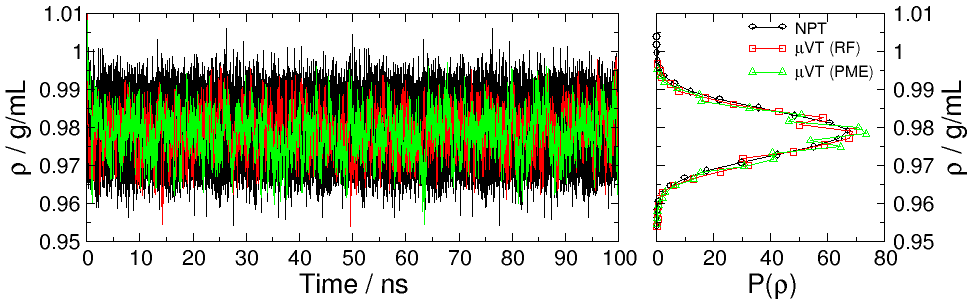

# Bulk water

Run 10ns of bulk water sampling, with GCMC moves every 1ps:

```
cd examples/water
python water.py
```

The plot below shows the GCMC bulk water density compared to that obtained
via constant pressure (NPT) simulation.


